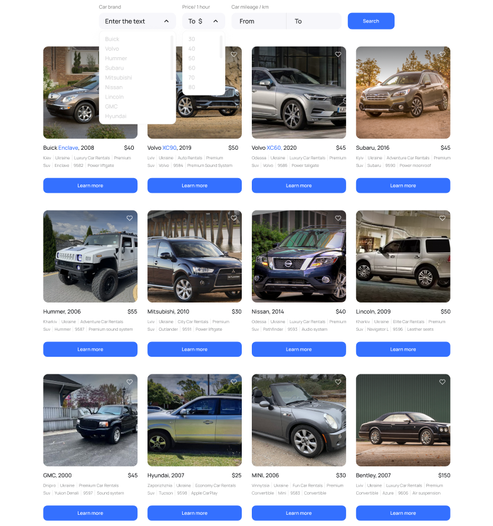

<h1 align="center"> 🏁 Choose and Ride 🏁 </h1>

⠀⠀⠀⠀⠀⠀⠀⠀⠀⠀⠀⠀⠀⠀⠀⠀

<h2 align="center"> 💭 Drive Your Dream Car Today 💭 </h2>

  
&nbsp;
&nbsp;
&nbsp;
&nbsp;

<h3 align="center"> 🏞 Adventure Awaits 🏞 </h3>

## Description

"Welcome to Choose and Ride, where car rentals are easy and hassle-free. Enjoy top-notch vehicles, flexible options, and excellent customer service."

**Key Features:**

🏎️ Top-notch vehicle fleet, including the latest models and all the amenities you desire.

🔍 Filter by brand, hourly rate, or car mileage.

💰 Flexible rentals with competitive pricing, finding your ideal car is a breeze.

🛠️ Meticulously maintained and serviced vehicles, ensuring a confident road experience.

👌 We understand the journey is as important as the destination, offering premium features in all our rentals.

📊 Exceptional customer service for a smooth and enjoyable rental experience from start to finish.

## Getting Started

Use this link to open the app: <https://flashforward55.github.io/car-card/>
